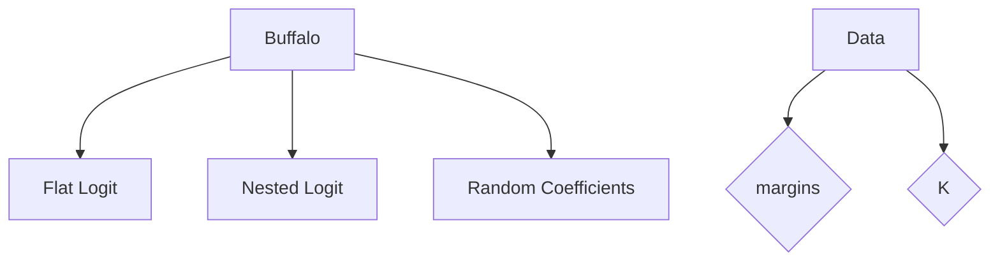

# buffalo
A package for the implementation of second-score auction merger simulation

```mermaid
graph TD;
    Buffalo-->B[Flat Logit];
    Buffalo-->C[Nested Logit];
    Buffalo-->D[Random Coefficients];
    Data-->E{margins}
    Data-->F{K}
```
